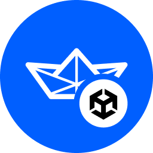

<p align="center">
  
</p>

<p align="center">
    The official Unity SDK for <a href="https://getstream.io/chat/sdk/unity/">Stream Chat</a>.
</p>

<p align="center">
    <a href="https://getstream.io/chat/sdk/unity/">Website</a>
    |
    <a href="https://getstream.io/chat/unity/tutorial/">Tutorial</a>
    |
    <a href="https://getstream.io/chat/docs/unity/?language=unity">SDK Documentation</a>
    |
    <a href="https://getstream.io/chat/trial/">Register for API Key</a>
</p>

<p align="center">
    <a href="https://github.com/GetStream/stream-chat-unity/releases/latest">
        
    </a>
    &nbsp;
	  <a href="https://github.com/GetStream/stream-chat-unity/actions/workflows/ci.yml">
        
    </a>
</p>

---

The **Stream Chat SDK** is the official Unity SDK for [Stream Chat](https://getstream.io/chat/sdk/unity/), a service for building chat and messaging games and applications.

- **Unity Engine 6, 2023.x, 2022.x, 2021.x, 2020.x, and 2019.x Support**
- **IL2CPP** Support
- **Automatic State Management** The Chat Client completely manages the state. You work with high-level models that simplify API interaction and are always up-to-date
- **Automatic Reconnection** Whenever the connection is lost, the chat client will reconnect automatically when the network is back
- **Realtime** Highly responsive experience using Websockets
- **Messaging:** Send direct or group messages, and have the messages persist across sessions
- **Channels:** group channels, private messages, etc.
- **Reactions:** Multiple users can react to every message, custom reactions
- **Moderation:** Banning (temporary, permanent, shadow), Muting (users, channels), Flagging (messages, users)
- **Roles & Permissions:** Admins, Moderators, custom roles with custom permission
- **Moderation Dashboard** Dedicated web panel to handle moderation
- **Search** Search through message history 
- **Unread counts** Show the last read message per user and count unread messages
- **Typing indicators** See who's currently writing a new message
- **Fully open-source**: Complete access to the SDK source code here on GitHub

## IL2CPP
IL2CPP is supported :rocket:

## WebGL
WebGL is supported :rocket:

## Free for Indie Developers

Stream is free for most side and hobby projects. You can use Stream Chat for free with less than five team members and no more than $10,000 in monthly revenue. Visit our website and [apply for the Makers Account](https://getstream.io/maker-account/).

## Getting Started

1. Download the [latest release .unitypackage](https://github.com/GetStream/stream-chat-unity/releases/latest).
2. Launch Unity Editor and import the downloaded `.unitypackage`
3. Resolve [dependencies](https://github.com/GetStream/stream-chat-unity#dependencies)
4. Start integrating Chat into your project! Check out the [Tutorial](https://getstream.io/chat/unity/tutorial/) to get yourself going.

## Tutorial
Check out our [tutorial](https://getstream.io/chat/unity/tutorial/) on how to setup your project and perform basic operations.

## Sample Project

In the `StreamChat/SampleProject` folder you'll find a fully working chat example featuring:
- Browsing channels and messages
- Sending, Editing, Deleting messaged
- Message right-click context menu
- Reactions/Emojis
- Member list with online status
- Typing indicators
- Moderation: flagging messages and users
- Sending video attachments (works only in Editor)

### Preview


Created with Unity's UGUI UI system and supports both legacy and the new Unity's Input System. 

### How to run it?
1. [Register](https://getstream.io/try-for-free/) an account and go to [Stream Dasboard](https://getstream.io/dashboard/)
2. Create App and go to its **Chat Explorer** throught the Dashboard
3. Create new chat user and save its **id**
4. Use our [online token generator](https://getstream.io/chat/docs/unity/tokens_and_authentication/?language=unity#manually-generating-tokens) to create user token
5. In Unity, provide: **Api Key**, **User Id** and **User Token** into `StreamChat/SampleProject/Config/DemoCredentials.asset`
6. Open `StreamChat/SampleProject/Scenes/ChatDemo.scene` and hit play

How to enable Unity's **[new Input System](https://docs.unity3d.com/Packages/com.unity.inputsystem@1.0/manual/index.html)**?:
1. Make sure that the UnityEngine.InputSystem package is available in the project
2. Add **UnityEngine.InputSystem** dll reference to the **StreamChat.Unity** assembly definition asset

## Dependencies

- **TextMeshPro** StreamChat/SampleProject requires a TextMeshPro package
- **Newtonsoft.Json** SDK uses [Unity's package for Newtonsoft Json]([com.unity.nuget.newtonsoft-json@3.0](https://docs.unity3d.com/Packages/com.unity.nuget.newtonsoft-json@3.0/manual/index.html)) Library for serialization.

:warning: In case you already have the Newtonsoft Json dll or package in your project and encounter the following error:<br>
`Multiple precompiled assemblies with the same name Newtonsoft.Json.dll included or the current platform. Only one assembly with the same name is allowed per platform.`
<br>you can remove the `StreamChat\Libs\Serialization\com.unity.nuget.newtonsoft-json@3.0.2` directory. Please note however, that Unity's package for Newtonsoft Json has IL2CPP support. If you wish to replace it and still use IL2CPP, make sure that the Json implementaion of your choice does support IL2CPP as well.

## Short Documentation (Cookbook)
Here are some quick Code Samples to get you started. For detailed information please check out our [Documentation](https://getstream.io/chat/docs/unity/?language=unity)

#### Vocabulary:
* `StreamChatClient` - the main chat manager that allows you to connect with the Stream Chat Server, create channels, query channels, users, and members based on provided criteria
* `StreamChannel` - channels group users in a conversation. Depending on your settings users may need to join channels as members in order to send messages
* `StreamUser` - represent a single user within your application
* `StreamChannelMember` - object representing a user that is a member of a specific channel. This object contains property `member.User` to access the user object
* `StreamMessage` - represents a single message within a channel

### Create an instance of chat client
User the `StreamChatClient.CreateDefaultClient();` factory method to create an instance of `IStreamChatClient`:
```csharp
public class ChatManager : MonoBehaviour
{
    public IStreamChatClient Client { get; private set; }
        
    protected void Awake()
    {
        Client = StreamChatClient.CreateDefaultClient();
    }
}
```

### Connect the user
Easiest way to start is to enable [developer authorization](https://getstream.io/chat/docs/unity/tokens_and_authentication/?language=unity#developer-tokens) and connect with client-side generated auth tokens:
```csharp
var userId = StreamChatClient.SanitizeUserId("user-name");
var userToken = StreamChatClient.CreateDeveloperAuthToken(userId);

// Replace API_KEY with your Api Key from the Stream Dashboard
var localUserData = await Client.ConnectUserAsync("API_KEY", userId, userToken);
```

### Async or Callback
Every function that waits for response from the server you can either call using the C# modern async/await syntax or append the `.AsCallback()` and use as classical callbacks as follows:
```csharp
Client.ConnectUserAsync("API_KEY", userId, userToken)
    .AsCallback(onSuccess: result =>
    {
        var localUserData = result;
    }, onFailure: exception =>
    {
        Debug.LogException(exception);
    });
```
The `.AsCallback()` method accepts two delegates: `Action<TResponse> onSuccess` and the `Action<Exception> onFailure` that you can use to react to both successfull and error response case.
Instead lambda callbacks you can also provide methods with the same signature as in the example below:
```csharp
public void ConnectUser()
{
    var userId = StreamChatClient.SanitizeUserId("user-name");
    var userToken = StreamChatClient.CreateDeveloperAuthToken(userId);

    Client.ConnectUserAsync("API_KEY", userId, userToken)
        .AsCallback(OnUserConnected, OnUserConnectionFailed);
}

private void OnUserConnected(IStreamLocalUserData localUserData)
{
    Debug.Log("User connected: " + localUserData.User.Name);
}

private void OnUserConnectionFailed(Exception exception)
{
    Debug.LogException(exception);
}
```
We strongly advice using the `async/await` syntax which, as you'll notice in the following examples, makes the code much simpler and easier to read and maintain.

### Create a channel
Once you're connected you can start using channels so that users can send messages.

There are 2 ways to create channels:
#### 1. By ID
For predefined channels to which users can join. This is great for any general purpose channels or clans, clubs, groups which users can join or leave.
```csharp
var channel = await Client.GetOrCreateChannelWithIdAsync(ChannelType.Messaging, "my-channel-id");
```
or with a callback:
```csharp
Client.GetOrCreateChannelWithIdAsync(ChannelType.Messaging, "my-channel-id")
    .AsCallback(channel =>
    {
        Debug.Log($"Channel {channel.Id} created successfully");
    }, exception =>
    {
        Debug.LogException(exception);
    });
```
#### 2. For a group of users
Great for public or private group messages, the order of users in group doesn't matter so whenever the users are connected using this method they will always see their chat history:
```csharp
var channel = await Client.GetOrCreateChannelWithMembersAsync(ChannelType.Messaging, users);
```
### Query Channels
To browse all channels or channels filtered by some criteria use `Client.QueryChannelsAsync`
#### Query channels to which local user belongs as a member
```csharp
var filters = new IFieldFilterRule[]
{
   ChannelFilter.Cid.In("channel-cid", "channel-2-cid", "channel-3-cid")
};
var sort = ChannelSort.OrderByAscending(ChannelSortFieldName.CreatedAt);

var channels = await Client.QueryChannelsAsync(filters, sort);
```
The filtering mechanism is very powerful and allows you to combine multiple rules. You can check the full list of available fields and operators that you can use for channel querying [here](https://getstream.io/chat/docs/unity/query_channels/?language=unity#channel-queryable-built-in-fields).

### Channel Filters Examples:
#### Filter for channels with Cid
```csharp
// Each operator usually supports multiple argument types to match your needs
ChannelFilter.Cid.EqualsTo("channel-cid"); // string
ChannelFilter.Cid.EqualsTo(channel); // IStreamChannel
ChannelFilter.Cid.In("channel-cid", "channel-2-cid", "channel-3-cid"); // Comma separated strings

var channelCids = new List<string> { "channel-1-cid", "channel-2-cid" };
ChannelFilter.Cid.In(channelCids); // Any collection of string
```
#### Filter for channels created by the local user
```csharp
var filters = new IFieldFilterRule[]
{
    ChannelFilter.CreatedById.EqualsTo(Client.LocalUserData.User)
};
```
#### Filter for channels with more than 10 members
```csharp
var filters = new IFieldFilterRule[]
{
    ChannelFilter.MembersCount.GreaterThan(10)
};
```
#### Filter for channels created last week
```csharp
var weekAgo = DateTime.Now.AddDays(-7).Date;
var filters = new IFieldFilterRule[]
{
    ChannelFilter.CreatedAt.GreaterThan(weekAgo)
};
```
#### Filter for channels updated within last 24 hours
```csharp
var dayAgo = DateTime.Now.AddHours(-24);
var filters = new IFieldFilterRule[]
{
    ChannelFilter.UpdatedAt.GreaterThan(dayAgo)
};
```

### Get messages
Messages are accessible via `channel.Messages` property that contains collection of the most recent messages. Because there can potentialy be thousands of messages in a channel history the `channel.Messages` collection contains only the latest messages. You can load older messages by calling the `channel.LoadOlderMessagesAsync()` which will load additional portion of the history. A common approach is to call `channel.LoadOlderMessagesAsync()` whenever users hits the end of your messages scroll view, this way you only load older messages when the user actually wants to view them. You can see an example of this approach in Sample Project's [MessageListView.cs](https://github.com/GetStream/stream-chat-unity/blob/develop/Assets/Plugins/StreamChat/SampleProject/Scripts/Views/MessageListView.cs#L34)

### Send message
```csharp
var sentMessage = await channel.SendNewMessageAsync("Hello");
```
### Send message to a thread
```csharp
var messageInThread = await channel.SendNewMessageAsync(new StreamSendMessageRequest
{
    ParentId = parentMessage.Id, // Write in thread
    ShowInChannel = false, // Optionally send to both thread and the main channel like in Slack
    Text = "Hello",
});
```
### Quote a message
```csharp
var messageWithQuote = await channel.SendNewMessageAsync(new StreamSendMessageRequest
{
    QuotedMessage = quotedMessage, // Reference to IStreamMessage 
    Text = "Hello",
});
```
### Silent message
Silent messages do not trigger events for channel members. Often used for system messages
```csharp
var silentMessage = await channel.SendNewMessageAsync(new StreamSendMessageRequest
{
    Text = "System message",
    Silent = true
});
```
### Pin message
#### Pin indefinitely
```csharp
await message.PinAsync();
```
#### Pin for a specified period of time
```csharp
await message.PinAsync(new DateTime().AddDays(7)); // Pin for 7 days
```
### Unpin a message
```csharp
await message.UnpinAsync();
```
### Update message
```csharp
await message.UpdateAsync(new StreamUpdateMessageRequest
{
    Text = "New changed message",
});
```
### Attach custom data to a message
```csharp
await message.UpdateAsync(new StreamUpdateMessageRequest
{
    CustomData = new StreamCustomDataRequest
    {
        {"CategoryId", 12},
        {"Awards", new string[]{"Funny", "Inspirational"}}
    }
});
```
### Delete a message
#### Soft Delete
Only clears the text but leaves other related data, reactions, thread sub-messages, etc. intact
```csharp
await message.SoftDeleteAsync();
```
#### Hard Delete
Removes a message completely and removes all data related to this message
```csharp
await messageInChannel.HardDeleteAsync();
```
### Add reactions to messages
#### Simple reaction
```csharp
await message.SendReactionAsync("like");
```
#### Reaction with custom score
```csharp
await message.SendReactionAsync("clap", 10);
```
#### Add reaction and remove any previous reactions from this user for this message
```csharp
await message.SendReactionAsync("love", enforceUnique: true);
```
### Delete reaction:
```csharp
await message.DeleteReactionAsync("like");
```
### Upload a file
```csharp
// Get file byte array however you want e.g. Addressables.LoadAsset, Resources.Load, etc.
var sampleFile = File.ReadAllBytes("path/to/file");
var fileUploadResponse = await channel.UploadFileAsync(sampleFile, "my-file-name");
var fileWebUrl = fileUploadResponse.FileUrl;
```
### Upload an image
```csharp
var sampleImage = File.ReadAllBytes("path/to/file");
var imageUploadResponse = await channel.UploadImageAsync(sampleFile, "my-image-name");
var imageWebUrl = imageUploadResponse.FileUrl;
```
### Delete file or image
```csharp
var channel = await Client.GetOrCreateChannelWithIdAsync(ChannelType.Messaging, channelId: "my-channel-id");
await channel.DeleteFileOrImageAsync("file-url");
```
### React to Channel changes
Channel objects are being automatically updated whenever any change occur (new messages, reactions, etc.). You can react to these changes by subscribing to `IStreamChannel` exposed events:
```csharp
channel.MessageReceived += OnMessageReceived;
channel.MessageUpdated += OnMessageUpdated;
channel.MessageDeleted += OnMessageDeleted;
channel.ReactionAdded += OnReactionAdded;
channel.ReactionUpdated += OnReactionUpdated;
channel.ReactionRemoved += OnReactionRemoved;
```
### Get local user or local user data
```csharp
var localUserData = Client.LocalUserData;
var localUser = localUserData.User;
```
* Local User Data - Additional data related to the user connected on the local device like: muted channels, list of devices, unread channels, unread messages, etc.
* Local User - instance of `StreamUser` representing the user on the local device
### Get all users
```csharp
var users = await Client.QueryUsersAsync();
```
### Find user by ID
```csharp
var users = await Client.QueryUsersAsync(new Dictionary<string, object>()
{
    {
        "id", new Dictionary<string, object>
        {
            { "$eq", otherUserId }
        }
    }
});
var otherUser = users.First();
```
### Find multiple users by ID
```csharp
var filters = new Dictionary<string, object>
{
    {
        "id", new Dictionary<string, object>
        {
            {
                "$in", listOfUserIds
            }
        }
    }
};

var users = await Client.QueryUsersAsync(filters);
```
Read more on supported [query parameters and operators](https://getstream.io/chat/docs/unity/query_users/?language=unity#suported-queries)

### Add Channel Members
Depending on your app configuration users may need to join channels as members in order to send messages or see other users messages
```csharp
// Multiple overloads available depending on your needs
await channel.AddMembersAsync(user); // instance of IStreamUser
await channel.AddMembersAsync(user1, user1); // Multiple instances of IStreamUser
await channel.AddMembersAsync(listOfUsers); // List<IStreamUser>
await channel.AddMembersAsync("user-id"); // string ID
await channel.AddMembersAsync(listOfUserIds); // List<string> that contains IDs
```
#### Remove Channel Members
```csharp
// Multiple overloads available depending on your needs
await channel.RemoveMembersAsync(member); // instance of IStreamChannelMember
await channel.RemoveMembersAsync(member1, member2); // Multiple instances of IStreamChannelMember
await channel.RemoveMembersAsync(listOfMembers); // List<IStreamChannelMember>
await channel.RemoveMembersAsync(user); // instance of IStreamUser
await channel.RemoveMembersAsync(user1, user1); // Multiple instances of IStreamUser
await channel.RemoveMembersAsync(listOfUsers); // List<IStreamUser>
await channel.RemoveMembersAsync("user-id"); // string ID
await channel.RemoveMembersAsync(listOfUserIds); // List<string> that contains IDs
```
### Moderation
Stream provides all the necessary tools and features to properly manage a large community.
### Flagging
Flagging means that this user or message will be reported to the chat moderation. Chat admins and moderators can view reported users and messages in the Dashboard.
#### Flag a user
```csharp
await user.FlagAsync();
```
#### Flag a message
```csharp
await message.FlagAsync();
```
### Ban a user
#### Ban indefinitely
```csharp
await channel.BanUserAsync(user);
```
#### Ban for a specified period of time
```csharp
await channel.BanUserAsync(user, "You got banned for 2 hours for toxic behaviour.", 120);
```
#### Ban user IP
Banning IP helps to prevent case where user creates a new account to bypass the ban.
```csharp
await channel.BanUserAsync(user, timeoutMinutes: 120, isIpBan: true);
```
#### Ban for a specified period of time
```csharp
await channel.BanUserAsync(user, "You got banned for 2 hours for toxic behaviour.", 120);
```
### Query Banned Users
```csharp
var request = new StreamQueryBannedUsersRequest
{
    CreatedAtAfterOrEqual = new DateTimeOffset().AddHours(-24),
    Limit = 30,
    Offset = 0,
};

var bannedUsersInfo = await Client.QueryBannedUsersAsync(request);
```
### Shadow Banning
Shadow banned user doesn't know he's being banned. This is sometimes helpful because it takes additional time for a user to realize the he's banned.
#### Shadow ban `StreamUser`
```csharp
await channel.ShadowBanUserAsync(user);
```
#### Shadow ban `StreamChannelMember`
```csharp
await channel.ShadowBanMemberAsync(channelMember);
```
### Mute a user
```csharp
await user.MuteAsync();
```
### Unmute a user
```csharp
await user.UnmuteAsync();
```
### Mute a channel
```csharp
await channel.MuteChannelAsync();
```
### Unmute a channel
```csharp
await channel.UnmuteChannelAsync();
```
### Check our documentation for more examples
The above examples are only a few out of many - check out our [Full Documentation](https://getstream.io/chat/docs/unity/?language=unity) for more insight and examples

---

## Missing any features?
Go ahead and open [GitHub](https://github.com/GetStream/stream-chat-unity/issues/new) Issue with your request and we'll respond as soon as possible.

---

## Any issues, bugs, or questions?
Reach out to our [Support](https://getstream.io/contact/support/).

---

## We are hiring

We've recently closed a [\$38 million Series B funding round](https://techcrunch.com/2021/03/04/stream-raises-38m-as-its-chat-and-activity-feed-apis-power-communications-for-1b-users/) and we keep actively growing.
Our APIs are used by more than a billion end-users, and you'll have a chance to make a huge impact on the product within a team of the strongest engineers all over the world.
Check out our current openings and apply via [Stream's website](https://getstream.io/team/#jobs).
